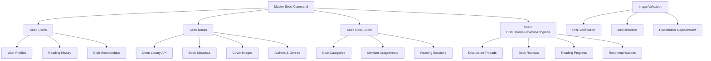

# Book Club Backend

This is the backend for the Book Club application, built with Django and Django REST Framework.

## Features

- User authentication (registration, login, logout)
- Create, join, and manage book clubs
- Search and discover book clubs
- Admin dashboard with analytics
- API for promoting users to staff

## Getting Started

### Prerequisites

- Python 3.8+
- Pipenv
- Node.js and npm (for running frontend tests)

### Installation

1.  **Clone the repository:**

    ```bash
    git clone https://github.com/your-username/Book-Club-backend.git
    cd Book-Club-backend
    ```

2.  **Install Python dependencies:**

    ```bash
    pipenv install
    pipenv shell
    ```

3.  **Install Node.js dependencies for Cypress tests:**

    ```bash
    npm install
    ```

4.  **Set up the database:**

    ```bash
    python manage.py migrate
    ```

5.  **Create an initial admin user:**

    This command creates a superuser with default credentials (`admin`/`password`).

    ```bash
    python manage.py create_initial_admin
    ```

### Environment Variables

Create a `.env` file in the project root and add the following variables. You can use the `.env.example` as a template.

```
# Database Configuration
DB_NAME=bookclub_db
DB_USER=bookclub_user
DB_PASSWORD=bookclub_password123
DB_HOST=localhost
DB_PORT=5432

# Django Configuration
SECRET_KEY=your-secret-key-here
DEBUG=True

# Admin user credentials (optional, for create_initial_admin command)
DJANGO_SUPERUSER_USERNAME=admin
DJANGO_SUPERUSER_EMAIL=admin@example.com
DJANGO_SUPERUSER_PASSWORD=password
```

### Running the Application

```bash
python manage.py runserver
```

The application will be available at `http://localhost:8000`.

## Admin Dashboard

The admin dashboard provides analytics and user management features with interactive charts and data visualization.

### Features

- **Books per Club Chart**: Visual representation of completed books across all book clubs
- **Reviews per Book Chart**: Shows which books have the most reviews/summaries
- **Active Clubs Analytics**: Count of book clubs with ongoing activity
- **User Management**: Promote regular users to staff status
- **Real-time Data**: All charts update with live data from the database

### Accessing the Dashboard

1. Log in as a superuser using credentials:
   - Email: `admin@example.com`
   - Password: `password` (or your custom credentials)

2. Navigate to `/admin/dashboard` in your browser

3. The dashboard will load with three main chart sections:
   - Books per Club (bar chart)
   - Summaries per Book (horizontal bar chart)
   - Active Clubs counter

### Dashboard Screenshots

> **📸 TODO**: Add screenshots of the working dashboard here:
> 1. Full dashboard view with all charts loaded
> 2. Close-up of the Books per Club chart
> 3. User management interface
> 4. Staff promotion workflow

**Example placeholders:**

```

*Admin dashboard showing all analytics charts*


*Interactive chart showing book completion statistics*


*GIF demonstrating user promotion to staff*
```

### Dashboard Data Sources

The dashboard pulls data from:
- `BookClub` model (for club statistics)
- `ReadingSession` model (for completed books)
- `Review` model (for book summaries/reviews)
- `Discussion` model (for club activity)
- `User` model (for user management)

## Testing

### Running Backend Tests

There are multiple test files that cover different aspects of the application:

1. **Run all tests:**
   ```bash
   python -m pytest
   ```

2. **Run specific test files:**
   ```bash
   # Authentication tests
   python -m pytest test_auth.py
   
   # Book club views tests
   python -m pytest test_bookclub_views.py
   
   # API endpoints tests
   python -m pytest test_api_endpoints.py
   
   # Admin authentication tests
   python -m pytest test_admin_auth.py
   ```

3. **Run with verbose output:**
   ```bash
   python -m pytest -v
   ```

### Test Coverage

The test suite covers:
- User authentication and authorization
- Book club CRUD operations
- API endpoint functionality
- Admin user management
- JWT token authentication
- Permission-based access control

### Running Frontend (Cypress) Tests

The project includes end-to-end tests for the admin dashboard functionality.

1. **Make sure the development server is running:**
   ```bash
   python manage.py runserver
   ```

2. **Run Cypress tests in headless mode:**
   ```bash
   npx cypress run
   ```

3. **Open the Cypress test runner (interactive mode):**
   ```bash
   npx cypress open
   ```

   This will open the Cypress interface, where you can run the `admin_dashboard.spec.js` test.

#### Cypress Test Coverage

The Cypress tests validate:
- Admin login flow
- Dashboard chart loading
- User permission restrictions
- Admin navigation visibility
- Chart data visualization

## Admin User Management

### Creating Admin Users

#### Method 1: Using Django Management Command

```bash
# With default credentials
python manage.py create_initial_admin

# With environment variables
export DJANGO_SUPERUSER_USERNAME=myadmin
export DJANGO_SUPERUSER_EMAIL=admin@mycompany.com
export DJANGO_SUPERUSER_PASSWORD=mysecurepassword
python manage.py create_initial_admin
```

#### Method 2: Using Django's Built-in Command

```bash
python manage.py createsuperuser
```

### Promoting Users to Staff

Once you have a superuser, you can promote regular users to staff status via the API:

1. **Get JWT token for superuser:**
   ```bash
   curl -X POST http://localhost:8000/api/auth/login/ \
     -H "Content-Type: application/json" \
     -d '{
       "email": "admin@example.com",
       "password": "password"
     }'
   ```

2. **List all users:**
   ```bash
   curl -X GET http://localhost:8000/api/admin/users/ \
     -H "Authorization: Bearer YOUR_JWT_TOKEN"
   ```

3. **Promote a user to staff:**
   ```bash
   curl -X PUT http://localhost:8000/api/admin/users/2/ \
     -H "Authorization: Bearer YOUR_JWT_TOKEN" \
     -H "Content-Type: application/json" \
     -d '{"is_staff": true}'
   ```

## API Endpoints

### Authentication
- `POST /api/auth/register/` - User registration
- `POST /api/auth/login/` - User login
- `POST /api/auth/logout/` - User logout
- `GET /api/auth/profile/` - User profile

### Book Clubs
- `GET /api/bookclubs/` - List book clubs
- `POST /api/bookclubs/` - Create book club
- `GET /api/bookclubs/{id}/` - Get book club details
- `PUT /api/bookclubs/{id}/` - Update book club
- `DELETE /api/bookclubs/{id}/` - Delete book club
- `GET /api/book-clubs/search/` - Search book clubs
- `GET /api/book-clubs/discover/` - Discover book clubs
- `GET /api/my-memberships/` - User's club memberships

### Admin Analytics (Requires superuser authentication)
- `GET /api/admin/stats/` - Combined analytics data
- `GET /api/admin/analytics/books/` - Books per club analytics
- `GET /api/admin/analytics/summaries/` - Reviews per book analytics
- `GET /api/admin/analytics/active-clubs/` - Active clubs count
- `GET /api/admin/users/` - List all users
- `PUT /api/admin/users/{id}/` - Promote/demote user

For detailed API documentation and examples, please refer to the `ADMIN_USER_GUIDE.md` file.

## Deployment

### Production Environment

For production deployment, ensure you:

1. **Set environment variables:**
   ```bash
   export DEBUG=False
   export SECRET_KEY="your-production-secret-key"
   export DJANGO_SUPERUSER_USERNAME="your-admin-username"
   export DJANGO_SUPERUSER_EMAIL="admin@yourcompany.com"
   export DJANGO_SUPERUSER_PASSWORD="secure-password"
   ```

2. **Run database migrations:**
   ```bash
   python manage.py migrate
   ```

3. **Create admin user:**
   ```bash
   python manage.py create_initial_admin
   ```

4. **Collect static files:**
   ```bash
python manage.py collectstatic --noinput

### Re-seeding the Database via Render

To re-seed the database without duplications during a Render manual deployment, follow these steps:

1. Go to the Render dashboard and navigate to the "Manual Deploy" section of your web service.
2. Execute the following build command:

   ```sh
   ./render-build.sh # This automatically skips seeding if SEED_ON_STARTUP is false
   ```

3. To explicitly run the seeding, enable the environment variable `SEED_ON_STARTUP` or run the following command:

   ```sh
   python manage.py master_seed --level=production --reset
   ```

   This will reset and run the master seed process, avoiding duplicates by flushing tables first if `--reset` is used.

4. Confirm the deployment and ensure logs indicate successful seeding.

> **📖 For detailed Render deployment instructions, see [RENDER_DEPLOYMENT.md](RENDER_DEPLOYMENT.md)**

### Docker Deployment

If using Docker, add environment variables to your container:

```dockerfile
ENV DJANGO_SUPERUSER_USERNAME=admin
ENV DJANGO_SUPERUSER_EMAIL=admin@company.com
ENV DJANGO_SUPERUSER_PASSWORD=strongpassword123

RUN python manage.py create_initial_admin
```

## Troubleshooting

### Common Issues

1. **"Permission denied" when accessing admin endpoints:**
   - Ensure your user has `is_staff=True` or `is_superuser=True`
   - Check JWT token is included in Authorization header
   - Verify token hasn't expired

2. **Tests failing:**
   - Make sure you're in the correct virtual environment: `pipenv shell`
   - Install test dependencies: `pip install pytest`
   - Check database permissions and connectivity

3. **Cypress tests not running:**
   - Ensure development server is running on port 8000
   - Check that Node.js dependencies are installed: `npm install`
   - Verify test data exists in the database

4. **Admin dashboard not loading:**
   - Check browser console for JavaScript errors
   - Verify API endpoints are returning data: `curl http://localhost:8000/api/admin/stats/`
   - Ensure charts library is properly loaded

### Getting Help

For additional support:
- Check the `ADMIN_USER_GUIDE.md` for detailed API usage
- Review test files for usage examples
- Check Django and DRF documentation for framework-specific issues

## Seeding Architecture

The Book Club backend includes a comprehensive seeding system for populating the database with realistic test data. The system is designed to be modular, scalable, and production-ready.

### Architecture Overview



### Seeding Commands

#### 1. Master Seed Command
**Usage:** `python manage.py master_seed [--level basic|full|production] [--reset]`

Orchestrates all seeding operations in the correct order with transaction safety.

**Levels:**
- `basic`: Minimal data for development (10 users, 20 books, 5 clubs)
- `full`: Complete dataset for testing (50 users, 100 books, 15 clubs)
- `production`: Optimized for demos (25 users, 50 books, 8 clubs)

#### 2. Seed Books Command
**Usage:** `python manage.py seed_books file.csv [options]`

Loads books from CSV/JSON files with Open Library API integration.

**Features:**
- CSV and JSON file support
- Open Library API integration for metadata
- Automatic cover image resolution
- ISBN validation and normalization
- Genre mapping from subjects
- Idempotent operations (prevents duplicates)
- Batch processing with progress bars

**CSV Format:**
```csv
title,author,published_year,isbn13,description,pages
"Pride and Prejudice","Jane Austen",1813,9780141439518,"A romantic novel",432
```

#### 3. Seed Users Command
**Usage:** `python manage.py seed_users [--count N] [--goodreads-csv file.csv]`

Creates diverse, realistic user profiles with international representation.

**Features:**
- Multi-locale user generation (20+ countries)
- Realistic bio generation
- Reading history from Goodreads CSV
- Book club role assignments
- Avatar URL generation
- Batch processing for performance

#### 4. Seed Discussions/Reviews/Progress Command
**Usage:** `python manage.py seed_discussions_reviews_progress [options]`

Generates realistic user-generated content and reading activity.

**Features:**
- Book-specific discussion content
- Bell curve rating distribution
- Reading progress snapshots
- Collaborative filtering recommendations
- Threaded discussion replies

#### 5. Image Validation Command
**Usage:** `python manage.py validate_images [--dry-run] [--models books,users,bookclubs]`

Validates and maintains image URLs across the platform.

**Features:**
- Weekly URL validation
- Concurrent request handling
- 404 detection and replacement
- Placeholder image generation
- Batch processing with rate limiting

### Data Flow

1. **Initialization**: Master seed command starts transaction
2. **User Creation**: Generate diverse user profiles with realistic data
3. **Book Import**: Load books from external files with API enhancement
4. **Club Formation**: Create book clubs and assign members
5. **Content Generation**: Create discussions, reviews, and reading progress
6. **Image Validation**: Verify and maintain all image URLs
7. **Completion**: Commit transaction and report statistics

### API Integration

#### Open Library API
- **Search Endpoint**: `/search.json` for book discovery
- **Works Endpoint**: `/works/{id}.json` for detailed metadata
- **Covers API**: `covers.openlibrary.org` for cover images
- **Rate Limiting**: 500ms between requests with exponential backoff
- **Error Handling**: Graceful degradation when API is unavailable

#### Image Services
- **Primary**: Open Library covers
- **Fallback**: Google Books API
- **Placeholders**: Unsplash book-themed images
- **User Avatars**: DiceBear avatar generation

### Error Handling & Resilience

- **Transaction Safety**: All operations wrapped in database transactions
- **Graceful Degradation**: Continue seeding even when external APIs fail
- **Retry Logic**: Exponential backoff for network requests
- **Validation**: Input sanitization and data validation
- **Logging**: Comprehensive logging for debugging
- **Dry Run Mode**: Test operations without database changes

### Performance Optimizations

- **Batch Processing**: Process records in configurable batches
- **Concurrent Requests**: Parallel API calls with thread pooling
- **Database Optimization**: Bulk creates and select_related queries
- **Memory Management**: Stream processing for large files
- **Progress Tracking**: Real-time progress bars with tqdm

### Troubleshooting Guide

#### Common Issues

**1. "File not found" error when seeding books**
```bash
# Solution: Check file path and permissions
ls -la path/to/your/file.csv
python manage.py seed_books sample_books.csv --dry-run
```

**2. Open Library API timeouts**
```bash
# Solution: Increase delay between requests
python manage.py seed_books file.csv --delay 1.0
```

**3. Memory issues with large datasets**
```bash
# Solution: Reduce batch size
python manage.py seed_books file.csv --batch-size 50
```

**4. Duplicate book entries**
```bash
# Solution: Use update existing flag
python manage.py seed_books file.csv --update-existing
```

**5. Image validation failures**
```bash
# Solution: Run with error details
python manage.py validate_images --dry-run --max-workers 1
```

#### Debug Commands

```bash
# Test seeding with minimal data
python manage.py master_seed --level basic --dry-run

# Validate single model images
python manage.py validate_images --models books --force

# Check API connectivity
python manage.py seed_books sample_books.csv --batch-size 1 --dry-run

# Clear and reseed specific data
python manage.py seed_users --clear --count 5
```

#### Logging Configuration

Add to `settings.py` for detailed seeding logs:

```python
LOGGING = {
    'version': 1,
    'disable_existing_loggers': False,
    'handlers': {
        'file': {
            'level': 'INFO',
            'class': 'logging.FileHandler',
            'filename': 'seeding.log',
        },
    },
    'loggers': {
        'myapp.management.commands': {
            'handlers': ['file'],
            'level': 'INFO',
            'propagate': True,
        },
    },
}
```

#### Performance Monitoring

```bash
# Monitor seeding performance
time python manage.py master_seed --level full

# Check database size after seeding
python manage.py dbshell
# SELECT COUNT(*) FROM myapp_book;
# SELECT COUNT(*) FROM myapp_user;
```

### Testing

Run comprehensive tests for all seeding commands:

```bash
# Run all seeding tests
pytest myapp/tests/test_seed_*.py -v

# Run specific command tests
pytest myapp/tests/test_seed_books.py::TestSeedBooksCommand -v

# Run integration tests
pytest myapp/tests/ -m integration

# Run with coverage
pytest --cov=myapp.management.commands myapp/tests/
```

## Project Structure

```
Book-Club-backend/
├── myapp/                     # Main Django application
│   ├── management/
│   │   └── commands/
│   │       ├── create_initial_admin.py
│   │       ├── master_seed.py         # Master seeding orchestrator
│   │       ├── seed_books.py          # Book seeding with API integration
│   │       ├── seed_users.py          # User profile seeding
│   │       ├── seed_discussions_reviews_progress.py
│   │       ├── seed_bookclubs.py      # Book club seeding
│   │       └── validate_images.py     # Image URL validation
│   ├── tests/                 # Comprehensive test suite
│   │   ├── __init__.py
│   │   ├── factories.py       # Test data factories
│   │   ├── test_seed_books.py
│   │   ├── test_seed_users.py
│   │   ├── test_seed_discussions_reviews_progress.py
│   │   ├── test_master_seed.py
│   │   └── test_validate_images.py
│   ├── templates/
│   ├── models.py
│   ├── views.py
│   ├── analytics_views.py
│   ├── serializers.py
│   └── urls.py
├── library/
│   └── images.py              # Image handling utilities
├── cypress/                   # End-to-end tests
│   └── integration/
│       └── admin_dashboard.spec.js
├── test_*.py                  # Additional backend test files
├── sample_books.csv           # Sample data for seeding
├── books.csv                  # Additional book data
├── requirements.txt           # Python dependencies
├── package.json              # Node.js dependencies
├── pytest.ini               # Pytest configuration
├── manage.py                 # Django management script
├── .env.example              # Environment variables template
└── README.md                 # This file
```
## Deployment

### Production Environment

For production deployment, ensure you:

1. **Set environment variables:**
   ```bash
   export DEBUG=False
   export SECRET_KEY="your-production-secret-key"
   export DJANGO_SUPERUSER_USERNAME="your-admin-username"
   export DJANGO_SUPERUSER_EMAIL="admin@yourcompany.com"
   export DJANGO_SUPERUSER_PASSWORD="secure-password"
   ```

2. **Run database migrations:**
   ```bash
   python manage.py migrate
   ```

3. **Create admin user:**
   ```bash
   python manage.py create_initial_admin
   ```

4. **Collect static files:**
   ```bash
   python manage.py collectstatic --noinput
   ```

### Docker Deployment

If using Docker, add environment variables to your container:

```dockerfile
ENV DJANGO_SUPERUSER_USERNAME=admin
ENV DJANGO_SUPERUSER_EMAIL=admin@company.com
ENV DJANGO_SUPERUSER_PASSWORD=strongpassword123

RUN python manage.py create_initial_admin
```

## Troubleshooting

### Common Issues

1. **"Permission denied" when accessing admin endpoints:**
   - Ensure your user has `is_staff=True` or `is_superuser=True`
   - Check JWT token is included in Authorization header
   - Verify token hasn't expired

2. **Tests failing:**
   - Make sure you're in the correct virtual environment: `pipenv shell`
   - Install test dependencies: `pip install pytest`
   - Check database permissions and connectivity

3. **Cypress tests not running:**
   - Ensure development server is running on port 8000
   - Check that Node.js dependencies are installed: `npm install`
   - Verify test data exists in the database

4. **Admin dashboard not loading:**
   - Check browser console for JavaScript errors
   - Verify API endpoints are returning data: `curl http://localhost:8000/api/admin/stats/`
   - Ensure charts library is properly loaded

### Getting Help

For additional support:
- Check the `ADMIN_USER_GUIDE.md` for detailed API usage
- Review test files for usage examples
- Check Django and DRF documentation for framework-specific issues

## Project Structure

```
Book-Club-backend/
├── myapp/                     # Main Django application
│   ├── management/
│   │   └── commands/
│   │       └── create_initial_admin.py
│   ├── templates/
│   ├── models.py
│   ├── views.py
│   ├── analytics_views.py
│   ├── serializers.py
│   └── urls.py
├── cypress/                   # End-to-end tests
│   └── integration/
│       └── admin_dashboard.spec.js
├── test_*.py                  # Backend test files
├── requirements.txt           # Python dependencies
├── package.json              # Node.js dependencies
├── manage.py                 # Django management script
├── .env.example              # Environment variables template
└── README.md                 # This file
```

