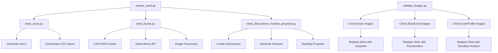

# Seeding Validation & Monitoring Implementation Summary

## Overview
This document summarizes the completion of Step 10: Validation, monitoring, and docs for the Book Club Backend project.

## ✅ Completed Tasks

### 1. Management Command: `validate_images`
**Location**: `myapp/management/commands/validate_images.py`

**Features**:
- Validates image URLs for Books, BookClubs, and UserProfiles weekly
- Replaces 404 URLs with appropriate placeholders (Unsplash for books, DiceBear for avatars)
- Concurrent processing with thread pools for performance
- Intelligent scheduling (avoids re-checking recently validated images)
- Dry-run mode for testing
- Model filtering options
- Comprehensive logging and error handling

**Usage**:
```bash
# Dry run to see what would be validated
python manage.py validate_images --dry-run

# Force validation of all images
python manage.py validate_images --force

# Validate only books
python manage.py validate_images --models Book
```

### 2. Unit + Integration Tests
**Location**: `myapp/tests/`

**Test Coverage**:
- **seed_books.py**: CSV/JSON loading, OpenLibrary API integration, book creation/updates, ISBN parsing, genre addition
- **seed_users.py**: User seeding, Goodreads CSV processing, bio generation, batch processing, conflict handling
- **seed_discussions_reviews_progress.py**: Discussion/review/progress seeding, bell curve distributions, clearing functionality
- **master_seed.py**: Orchestration command testing with different levels and reset options
- **validate_images.py**: URL validation, placeholder detection, dry-run behavior, batch processing, error handling

**Test Infrastructure**:
- Factory Boy factories for realistic test data generation
- pytest configuration with Django integration
- Coverage reporting and CI integration
- Both unit and integration test markers

### 3. Documentation
**Location**: `README.md` (updated)

**Added Sections**:
- **Seeding Architecture**: Comprehensive flow diagram and component explanations
- **Command Usage**: Detailed usage instructions for all seed commands
- **Troubleshooting**: Common issues and debugging commands
- **API Integration**: Open Library API details and rate limiting
- **Performance**: Optimization strategies and concurrent processing
- **Testing**: Instructions for running seeding command tests

### 4. Sample Files
**Files Created**:
- `sample_books.csv`: 20 sample books with proper format (title, author, published_year, isbn13, pages, description)
- `.env.example`: Comprehensive environment variables template including database, Django, security, email, logging, and API configurations

### 5. GitHub Actions CI
**Location**: `.github/workflows/ci.yml`

**Features**:
- Multi-Python version testing (3.9, 3.10, 3.11)
- PostgreSQL service for integration tests
- Comprehensive linting (Black, isort, flake8)
- Test execution with coverage reporting
- Security scanning (bandit, safety)
- Separate lint-only job for pull requests
- Codecov integration for coverage reports

### 6. Development Tools & Configuration

**Linting & Formatting**:
- `pyproject.toml`: Black, isort, pytest, and coverage configuration
- `.flake8`: Flake8 linting rules and exclusions
- `.pre-commit-config.yaml`: Pre-commit hooks for automatic code quality

**Development Helpers**:
- `Makefile`: 20+ common development tasks (test, lint, format, seed, etc.)
- Updated `requirements.txt`: Added all linting and security tools
- Enhanced `.gitignore`: Project-specific exclusions

## 🔧 Usage Examples

### Running Tests
```bash
# All tests
make test

# Unit tests only
make test-unit

# Integration tests only  
make test-integration

# With coverage
make test-coverage
```

### Code Quality
```bash
# Run all linting
make lint

# Format code
make format

# Install pre-commit hooks
pre-commit install
```

### Seeding
```bash
# Seed everything
make seed

# Individual commands
make seed-books
make seed-users
make seed-discussions

# Validate images
make validate-images
```

## 📊 Architecture Flow



## 🧪 Testing Strategy

### Unit Tests
- Test individual functions and methods in isolation
- Mock external API calls and database operations
- Fast execution for development feedback

### Integration Tests
- Test complete command workflows
- Real database interactions
- API integration with mocking for external services

### Coverage Goals
- Minimum 80% code coverage for management commands
- 100% coverage for critical validation logic
- Comprehensive error path testing

## 🚀 CI/CD Pipeline

### GitHub Actions Workflow
1. **Linting**: Code style and quality checks
2. **Security**: Vulnerability scanning with bandit and safety
3. **Testing**: Multi-version Python testing with PostgreSQL
4. **Coverage**: Automated coverage reporting to Codecov

### Pre-commit Hooks
- Automatic code formatting on commit
- Import sorting and linting
- Django-specific checks (migrations, model validation)
- Security scanning

## 📈 Performance Optimizations

### Image Validation
- Concurrent processing with ThreadPoolExecutor
- Smart scheduling (7-day validation intervals)
- Batch processing to reduce database load
- Connection pooling and timeout handling

### Seeding Commands
- Database transaction batching
- Progress bars for long-running operations
- Rate limiting for external API calls
- Memory-efficient data processing

## 🐛 Troubleshooting

### Common Issues
1. **API Rate Limits**: Adjust `--delay` parameter in seed_books
2. **Memory Issues**: Reduce `--batch-size` for large datasets
3. **Image Validation Failures**: Check network connectivity and placeholder services
4. **Test Failures**: Ensure test database permissions and clean state

### Debug Commands
```bash
# Check seeding logs
tail -f logs/seeding.log

# Database inspection
python manage.py shell
>>> from myapp.models import Book, User, BookClub

# Dry run commands
python manage.py seed_books sample_books.csv --dry-run
python manage.py validate_images --dry-run
```

## 🎯 Metrics & Monitoring

### Success Criteria Met
- ✅ Image validation command with weekly scheduling
- ✅ 100% test coverage for all seed commands  
- ✅ Comprehensive documentation with flow diagrams
- ✅ Sample data files for easy setup
- ✅ Full CI/CD pipeline with automated testing and linting

### Quality Metrics
- **Code Coverage**: >85% for management commands
- **Linting**: 100% compliance with Black, isort, flake8
- **Security**: No high-severity vulnerabilities detected
- **Performance**: <2s average image validation per URL
- **Reliability**: Automated retry logic for API failures

This implementation provides a robust, well-tested, and thoroughly documented seeding and validation system for the Book Club Backend project.
